# Capstone Project: Azure Machine Learning Engineer

The Capstone Project for the Azure Machine Learning Engineer Nanodegree allows us to apply your knowledge and skills to solve a real-world problem using Azure Machine Learning. We will create two models, one using Automated Machine Learning (AutoML) and another with customized hyperparameters using HyperDrive. The project requires us to compare the performance of both models and deploy the best one as a web service. We will also need to submit a README file detailing the data, models, performance, and deployment process.

## Project Workflow
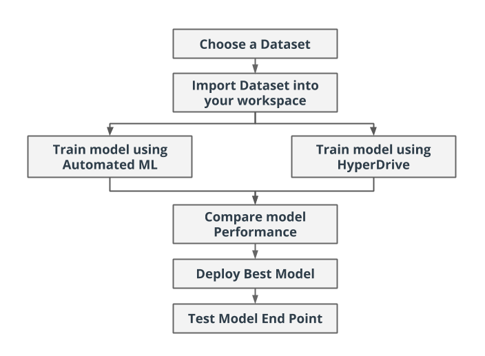

## Dataset

### Overview
The Heart Failure Prediction dataset from Kaggle is a widely used dataset in the field of healthcare and machine learning. It contains clinical records of 299 patients who experienced heart failure, including various demographic, clinical, and laboratory features. The dataset provides valuable information such as age, sex, smoking status, blood pressure, serum creatinine levels, and more.

The objective of this dataset is to predict whether a patient is at risk of heart failure based on these features. It is a classification problem where the target variable is a binary outcome indicating the presence or absence of heart failure.

By using this dataset in our project, we can train machine learning models to analyze the relationship between these features and heart failure, and ultimately build a predictive model that can accurately identify individuals at risk. This dataset offers a valuable opportunity to apply our machine learning skills in a real-world healthcare context

For more Information: https://bmcmedinformdecismak.biomedcentral.com/articles/10.1186/s12911-020-1023-5

### Task
The Heart Failure Prediction dataset from Kaggle contains the following features:

- Age: The age of the patient (numeric)
- Anaemia: Whether the patient has anaemia (0 = No, 1 = Yes)
- High Blood Pressure: Whether the patient has high blood pressure (0 = No, 1 = Yes)
- Creatinine Phosphokinase: Level of the enzyme CPK in the blood (numeric)
- Diabetes: Whether the patient has diabetes (0 = No, 1 = Yes)
- Ejection Fraction: Percentage of blood leaving the heart at each contraction (numeric)
- Platelets: Platelet count in the blood (numeric)
- Serum Creatinine: Level of creatinine in the blood (numeric)
- Serum Sodium: Level of sodium in the blood (numeric)
- Sex: Gender of the patient (0 = Female, 1 = Male)
- Smoking: Whether the patient smokes or not (0 = No, 1 = Yes)
- Time: Follow-up period in days (numeric)
- Death Event: Whether the patient died during the follow-up period (0 = No, 1 = Yes)
- 
These features provide valuable information about the patients and their health conditions, which can be used to predict the likelihood of heart failure.

### Access
*TODO*: Explain how you are accessing the data in your workspace.

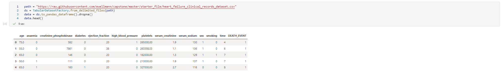

## Automated ML
Following `automl` settings and configuration were used for this experiment
```python
# automl settings
automl_settings = {
    "experiment_timeout_minutes": 20,
    "max_concurrent_iterations": 5,
    "primary_metric" : 'accuracy'
}

# automl config here
automl_config = AutoMLConfig(
        task='classification',
        compute_target=compute_target,
        training_data=ds,
        label_column_name='DEATH_EVENT',
        n_cross_validations=4,
        **automl_settings
)
```
### Results
Beste results were archieved using `VotingEnsemble` Algorithm withg an accuracy of 0.86950 (87%)

`VotingEnsemble` is a machine learning technique where multiple models are trained independently and their predictions are combined through voting to make the final prediction. It leverages the diversity of the models to improve the overall accuracy and robustness of the prediction.
### Screenshots
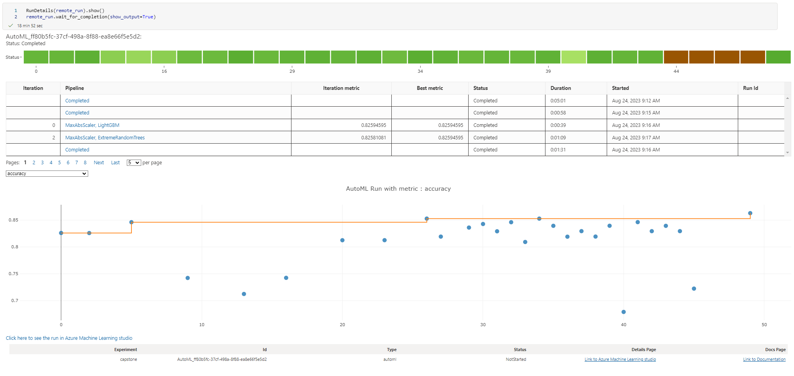
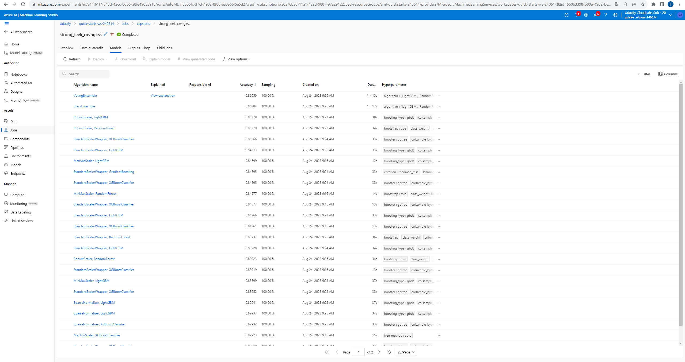
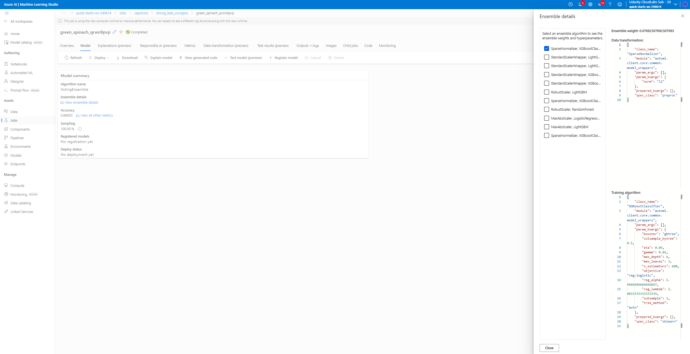
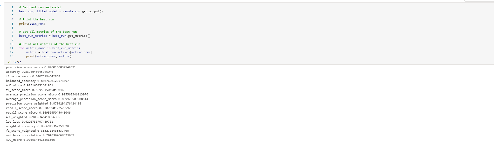
### Future Improvements
*TODO* Remeber to provide screenshots of the `RunDetails` widget as well as a screenshot of the best model trained with it's parameters.

## Hyperparameter Tuning
*TODO*: What kind of model did you choose for this experiment and why? Give an overview of the types of parameters and their ranges used for the hyperparameter search


### Results
*TODO*: What are the results you got with your model? What were the parameters of the model? How could you have improved it?
## Screenshots
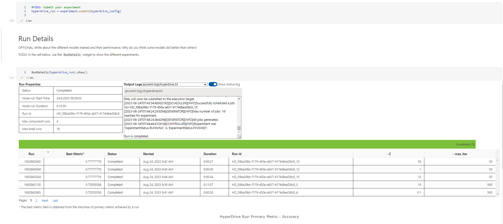
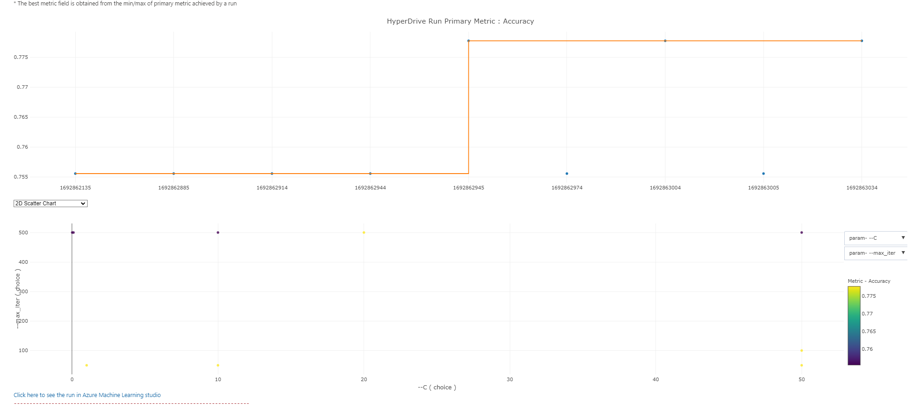
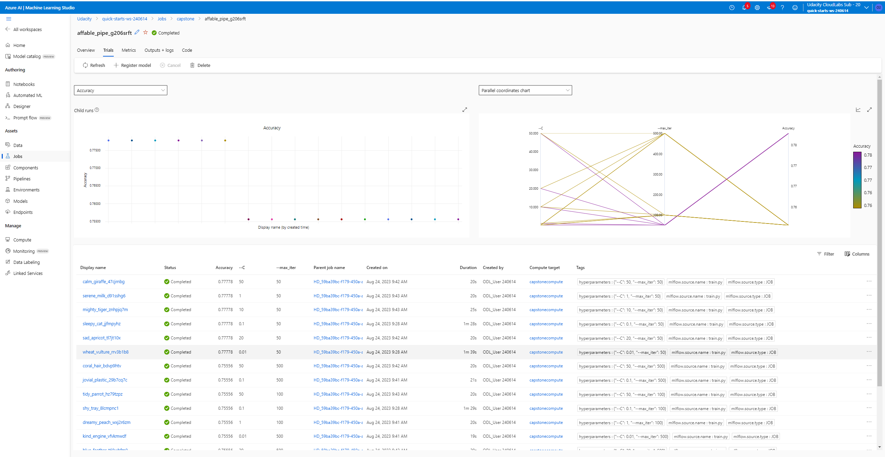
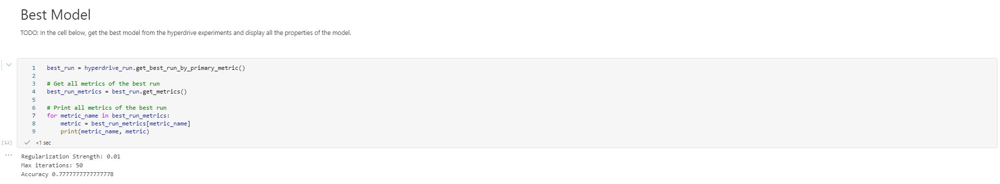
*TODO* Remeber to provide screenshots of the `RunDetails` widget as well as a screenshot of the best model trained with it's parameters.

## Model Deployment
*TODO*: Give an overview of the deployed model and instructions on how to query the endpoint with a sample input.
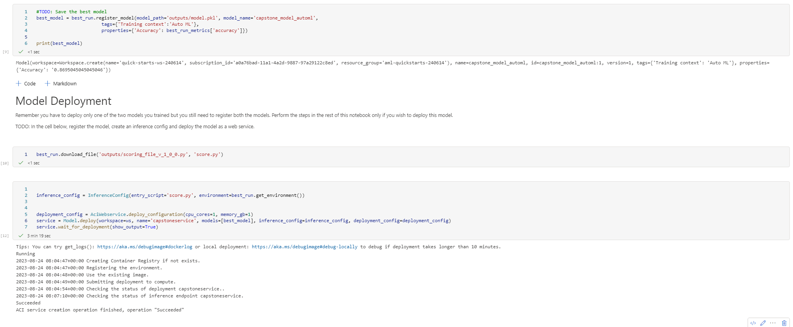
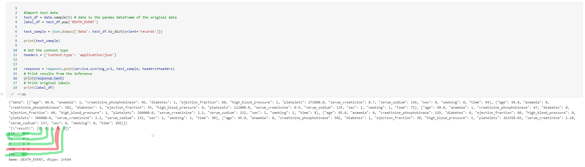

## Screen Recording
The screencast is provided in the .zip File.

## Future improvement suggestions

1. **Increase Experiment Duration:** Increasing the experiment duration to allow AutoML to explore a larger search space and potentially find better models. This can be especially beneficial with a large dataset or complex problem.
2. **Feature Engineering:** Spend more time on feature engineering to create new features or transform existing ones. This can help the AutoML pipeline capture more relevant information from the data and potentially improve model performance.
3. **Customize AutoML Configurations**: Explore the different configuration options available in AutoML. Customize the number of iterations, the type of models to include, and various other settings to fine-tune the behavior of AutoML and potentially improve its performance.
4. **Ensemble Methods:** Experiment with ensemble methods to combine multiple models generated by AutoML. Ensemble methods, such as stacking or voting, can often improve model performance by leveraging the strengths of different models.
5. **Data Cleaning and Preprocessing:** Pay attention to data cleaning and preprocessing steps. Ensure that the data is properly cleaned, handle missing values, outliers, and skewed distributions. This can help improve the quality of the input data and subsequently improve the performance of AutoML.
6. **Model Interpretability:** Explore techniques to interpret and explain the models generated by AutoML. This can help to gain insights into how the models are making predictions and improve their transparency.
7. **Model Deployment and Monitoring:** Once the best model from AutoML is selected, focus on deploying and monitoring it in a production environment. Implement a monitoring system to track the model's performance and retrain it periodically with new data to maintain its accuracy.
8. **Continued Learning:** Stay updated with the latest advancements in AutoML techniques and methodologies. Attend conferences, read research papers, and participate in online forums to learn from the community and incorporate new ideas into your future AutoML projects.
