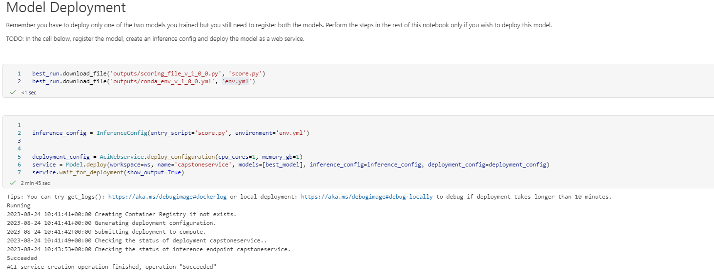

# Capstone Project: Azure Machine Learning Engineer

The Capstone Project for the Azure Machine Learning Engineer Nanodegree allows us to apply your knowledge and skills to solve a real-world problem using Azure Machine Learning. We will create two models, one using Automated Machine Learning (AutoML) and another with customized hyperparameters using HyperDrive. The project requires us to compare the performance of both models and deploy the best one as a web service. We will also need to submit a README file detailing the data, models, performance, and deployment process.

## Project Workflow

The workflow of the project involves choosing an external dataset, importing it into the workspace, and training two models using automated ML and HyperDrive. The performance of the models is then compared, and the best-performing model is deployed as a web service. Finally, the model endpoint is tested, and a README file is completed to describe the project and its results.


## Dataset

### Overview
The Heart Failure Prediction dataset from Kaggle is a widely used dataset in the field of healthcare and machine learning. It contains clinical records of 299 patients who experienced heart failure, including various demographic, clinical, and laboratory features. The dataset provides valuable information such as age, sex, smoking status, blood pressure, serum creatinine levels, and more.

The objective of this dataset is to predict whether a patient is at risk of heart failure based on these features. It is a classification problem where the target variable is a binary outcome indicating the presence or absence of heart failure.

By using this dataset in our project, we can train machine learning models to analyze the relationship between these features and heart failure, and ultimately build a predictive model that can accurately identify individuals at risk. This dataset offers a valuable opportunity to apply our machine learning skills in a real-world healthcare context

For more Information: https://bmcmedinformdecismak.biomedcentral.com/articles/10.1186/s12911-020-1023-5

### Task
The Heart Failure Prediction dataset from Kaggle contains the following features:

- Age: The age of the patient (numeric)
- Anaemia: Whether the patient has anaemia (0 = No, 1 = Yes)
- High Blood Pressure: Whether the patient has high blood pressure (0 = No, 1 = Yes)
- Creatinine Phosphokinase: Level of the enzyme CPK in the blood (numeric)
- Diabetes: Whether the patient has diabetes (0 = No, 1 = Yes)
- Ejection Fraction: Percentage of blood leaving the heart at each contraction (numeric)
- Platelets: Platelet count in the blood (numeric)
- Serum Creatinine: Level of creatinine in the blood (numeric)
- Serum Sodium: Level of sodium in the blood (numeric)
- Sex: Gender of the patient (0 = Female, 1 = Male)
- Smoking: Whether the patient smokes or not (0 = No, 1 = Yes)
- Time: Follow-up period in days (numeric)
- Death Event: Whether the patient died during the follow-up period (0 = No, 1 = Yes)
- 
These features provide valuable information about the patients and their health conditions, which can be used to predict the likelihood of heart failure.

### Access
To import external data using the `TabularDatasetFactory` in Azure Machine Learning, you can provide the URL or the path to the data source as a parameter to the `from_delimited_files` method. This will create a TabularDataset object that can be used for further data processing and model training.


## Automated ML
Following `automl` settings and configuration were used for this experiment
```python
# automl settings
automl_settings = {
    "experiment_timeout_minutes": 20,
    "max_concurrent_iterations": 5,
    "primary_metric" : 'accuracy'
}

# automl config here
automl_config = AutoMLConfig(
        task='classification',
        compute_target=compute_target,
        training_data=ds,
        label_column_name='DEATH_EVENT',
        n_cross_validations=4,
        **automl_settings
)
```
### Results
Beste results were archieved using `VotingEnsemble` Algorithm withg an accuracy of 0.86950 (87%)

`VotingEnsemble` is a machine learning technique where multiple models are trained independently and their predictions are combined through voting to make the final prediction. It leverages the diversity of the models to improve the overall accuracy and robustness of the prediction.
### Screenshots


### Future Improvements
To improve the output of the Automated ML model, following steps can be considered to achive better results:

1. Increase the experiment timeout duration to allow for more time for model training and exploration of different algorithms and configurations.
2. Enable early stopping to terminate poorly performing iterations early and focus on iterations that show promise.
3. Adjust the primary metric to prioritize the evaluation metric that is most important for your specific problem.
4. Increase the concurrency settings to run multiple iterations in parallel, allowing for more exploration of different models and hyperparameters.

## Hyperparameter Tuning

For the HyperDrive run we choose the logistic regression algorithm from the SKLearn framewokr. Logistic regression is a popular algorithm used for binary classification tasks. In the HyperDrive model, you can specify the hyperparameters of the logistic regression algorithm, such as the regularization strength `C` and the number of iterations `max_iter`. The HyperDrive will then explore different combinations of hyperparameters to find the best-performing model based on the specified evaluation metric

### Hyperdrive Configuration

We chose `BanditPolicy` as the early stopping policy. BanditPolicy stops poorly performing runs based on a slack factor and evaluation interval. It compares the performance of each run to the best performing run at a given evaluation interval and terminates runs that are not within the slack factor of the best performing run.

As hyperparameter sampling method we choose `RandomParameterSampling` that randomly selects values for each hyperparameter from a defined search space. It allows for a more comprehensive exploration of the hyperparameter space, increasing the chances of finding the optimal combination of hyperparameters for the model.

Any other parameters such as searchspace, primary metric, total_runs, ... can be found in the codesnipped below.

```python
# Create an early termination policy. This is not required if you are using Bayesian sampling.
early_termination_policy = BanditPolicy(evaluation_interval=2, slack_factor=0.1)

# Create the different params that you will be using during training
param_sampling = RandomParameterSampling(
    {
        '--C': choice(0.01,0.1,1,10,20,50),
        '--max_iter': choice(50,100,500)
    }
)

# Create your estimator and hyperdrive config
sklearn_env = Environment.from_conda_specification(name='sklearn-env', file_path='conda_dependencies.yaml')
estimator = ScriptRunConfig(source_directory="./.",
                      script='train.py',
                      compute_target=compute_target,
                      environment=sklearn_env)

hyperdrive_config = HyperDriveConfig(run_config = estimator,
                hyperparameter_sampling=param_sampling, 
                primary_metric_name='Accuracy',
                primary_metric_goal=PrimaryMetricGoal.MAXIMIZE,
                policy=early_termination_policy,
                max_total_runs=16,
                max_concurrent_runs=4)
```


### Results
The best accuracy achived using hyperdrive was 0.77778 (78%) using following parameters:
- C: 0.01
- max_inter: 50

## Screenshots


### Future Improvements
To improve the performance of HyperDrive runs, we can consider the following strategies:

1. Expand the search space: Increase the range or granularity of the hyperparameter values to explore a wider range of possibilities. This can help discover better-performing models.
2. Use a more advanced sampling method: Instead of random or grid sampling, consider using more advanced methods like Bayesian sampling or Hyperband. These methods can intelligently explore the hyperparameter space and focus on promising areas.
3. Increase the number of iterations: Allow HyperDrive to run for a longer duration or increase the maximum number of iterations. This gives more time for the search algorithm to find better-performing models.
4. Use a more sophisticated early termination policy: Choose a more advanced early termination policy that can dynamically stop poorly performing runs. This can save time by terminating runs that are unlikely to improve further.
5. Feature engineering and data preprocessing: Prioritize feature engineering and data preprocessing techniques to improve the quality and relevance of the input data. This can have a significant impact on the model's performance.
6. Experiment with different algorithms: Consider trying different algorithms or model architectures to see if they perform better for your specific problem. HyperDrive can be used to tune hyperparameters for various algorithms, allowing you to find the best combination.

## Model Deployment

Model deployment involves making our trained model accessible and usable in a production environment. In Azure Machine Learning, we can deploy a model as a web service, which allows other applications to send data to the deployed model and receive predictions in return. During deployment, we need to specify the compute target, the scoring script that defines how the input data is processed, and the environment dependencies. Once deployed, we can test the web service using sample data and ensure that it is functioning as expected before integrating it into your application or workflow.

The codesnipped below displays the steps to query the model and the results are beautifully highlighted in the screenshot.




## Screen Recording
The screencast is provided in the .zip File.

## Future improvement suggestions

1. **Increase Experiment Duration:** Increasing the experiment duration to allow AutoML to explore a larger search space and potentially find better models. This can be especially beneficial with a large dataset or complex problem.
2. **Feature Engineering:** Spend more time on feature engineering to create new features or transform existing ones. This can help the AutoML pipeline capture more relevant information from the data and potentially improve model performance.
3. **Customize AutoML Configurations**: Explore the different configuration options available in AutoML. Customize the number of iterations, the type of models to include, and various other settings to fine-tune the behavior of AutoML and potentially improve its performance.
4. **Ensemble Methods:** Experiment with ensemble methods to combine multiple models generated by AutoML. Ensemble methods, such as stacking or voting, can often improve model performance by leveraging the strengths of different models.
5. **Data Cleaning and Preprocessing:** Pay attention to data cleaning and preprocessing steps. Ensure that the data is properly cleaned, handle missing values, outliers, and skewed distributions. This can help improve the quality of the input data and subsequently improve the performance of AutoML.
6. **Model Interpretability:** Explore techniques to interpret and explain the models generated by AutoML. This can help to gain insights into how the models are making predictions and improve their transparency.
7. **Model Deployment and Monitoring:** Once the best model from AutoML is selected, focus on deploying and monitoring it in a production environment. Implement a monitoring system to track the model's performance and retrain it periodically with new data to maintain its accuracy.
8. **Continued Learning:** Stay updated with the latest advancements in AutoML techniques and methodologies. Attend conferences, read research papers, and participate in online forums to learn from the community and incorporate new ideas into your future AutoML projects.
